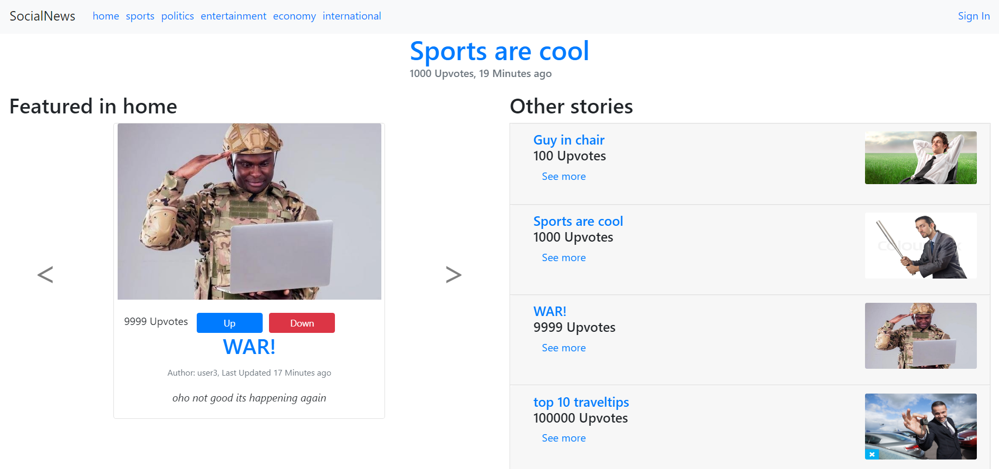

# General:
_The following requirements have been satisfied:_
<br/>
-Rolling newsfeed with recent articles and menu with categories
<br/>
-Main stories for each category (ordered by upvotes rather than importance)
<br/>
-All pages split into components
<br/>
-Ability to delete/update/write articles once logged in.
<br/>
-Usage of reusable components (the upvote widget)
<br/>
-Usage of both service and store objects on the clientside
<br/>
-All attributes for article (importance replaced with upvotes)
<br/>
-Used sequelize for DB-management
<br/>
-Applied restful principles, functional algorithms and static type-checking.
<br/>
-Use of both testing and CI on gitlab
<br/>
<br/>
_The following extra features have been added:_
<br/>
-Upvote and comment system
<br/>
-User system (has to be logged in to use the above functionality)
<br/>
-Hashing in database for user security and tokens for verification
<br/>
-Web-socket for newsfeed.


## Client: start
From the top-level repository folder:
```sh
cd client
npm install
npm start
```

## Server: start
Add your own db-username, db-password and set demo to `true `in `server/server.properties`.
then, to start:
```sh
cd server
npm install
npm start
```
To run any of the Jest tests make sure demo is set to `false` in the properties file.
The Demo property dictates what kind of testdata you are using, and the tests will fail if demo is set to `true`
The opposite goes for the webpage, it can only render if demo is set to `true`, as the non-demo testdata lacks foreign keys that are necessary for the rendering.
## Open application
http://localhost:4000/#/news/home
<br/>
You can sign in with the username _user1_ and the password _secret_ to test functionality.
<br/>
## The website
The main page looks like this, the carousel to the left contain the top 3 most popular articles in that category.
The list to the right contains all the articles in the category, limited to 20 at a time. The newsfeed is right underneath the navbar, containing the three most recent articles. 


When pressing an article title you will be directed to the read story page.
 
 
In order to comment, upvote or write an article, you have to sign in or create a user (all passwords are hashed).
 
 You will receive an alert and be redirected if the login/registration was successful.
 If you have trouble signing in try one of the test-users: username _user1_ and password _secret_
 
 Once logged in you can edit/delete articles you have posted by pressing your username in the navbar.
 
 
 The write article page looks like this
 
 When you write an article and post it, you can see it in the newsfeed or on the top of the list in the category you chose.
 
      
